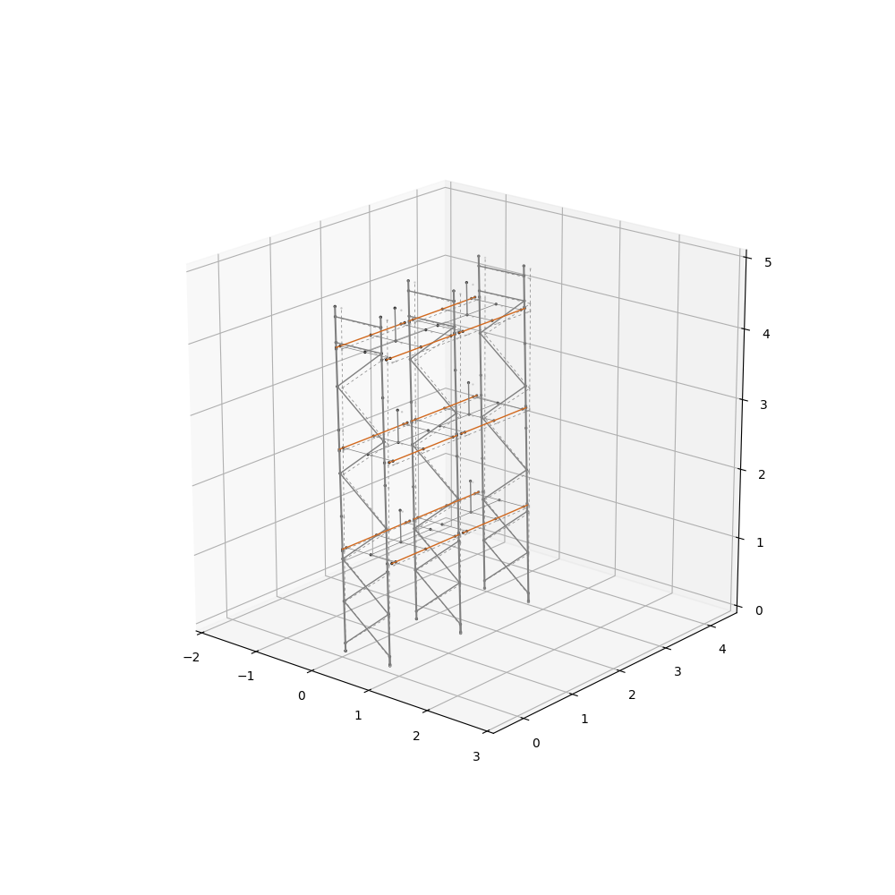

# OpenSees 3D visualisation

A Python script that reads OpenSees simulation input and output files to create a 3D visualisation of your displaced model

You can use the script to visualise node locations as points in 3D space and elements as lines between nodes, with the ability to customise colours, linestyles, and linewidths easily.

## Dependancies

The script is written for python3 and uses the following packages:

- Pandas
- Numpy
- Matplotlib

## Example

The script is currently setup to run the example model located in the `./example` subfolder.

- `./example/example-model.tcl` is an example OpenSees file that defines the nodes and elements of a storage rack.

- `./example/example-disps.out` is the output file produced by a pushover analysis run in OpenSees on the rack. The script will also handle OpenSees' `.xml` output format.

With the following settings:

```python
scalefactor = 1    # Displacement scalefactor
azimuth = -50      # Angle from which to view structure
elevation = 20     # Elevation from which to view structure
```

we can get the following result:



In this example the undisplaced structure is plotted using dashed lines, and the displaced structure is plotted using solid coloured lines. The lineweights and colours of the displaced structure are customised to make the plot look nice and clean.
